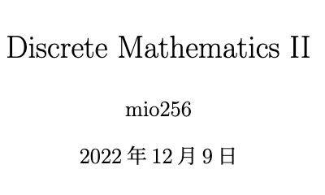

# discrete_math

## Overview

- note for Discrete Mathmatics II

[main.pdf](./out/main.pdf)

## Requirement

- latex

[VSCode で最高の LaTeX 環境を作る](https://qiita.com/rainbartown/items/d7718f12d71e688f3573)

## Usage

- study

## Features

- 

## Reference

[Discrete Mathematics: An Open Introduction, 3rd edition](https://discrete.openmathbooks.org/dmoi3.html)

[LaTeX Workshop - VSCode Extension](https://github.com/James-Yu/LaTeX-Workshop/wiki)

[LATEX 入門 - 明治大学](https://www.isc.meiji.ac.jp/~mizutani/tex/latex_manual/latex.pdf)

[LaTeX入門 - 数式コマンドリファレンス](https://medemanabu.net/latex/)

## Author

[mio256](https://github.com/mio256)

## Licence

MIT License